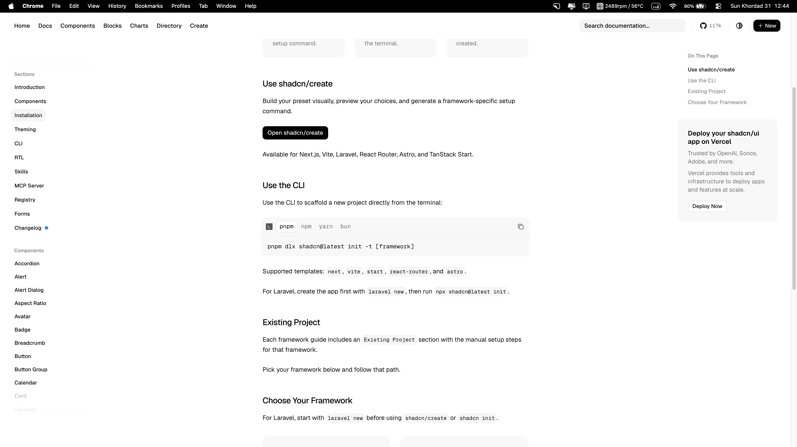
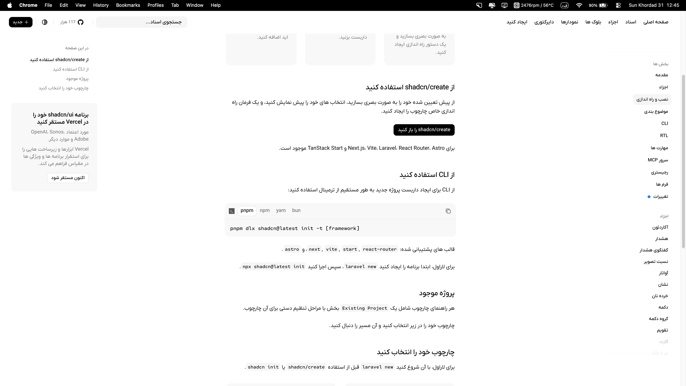
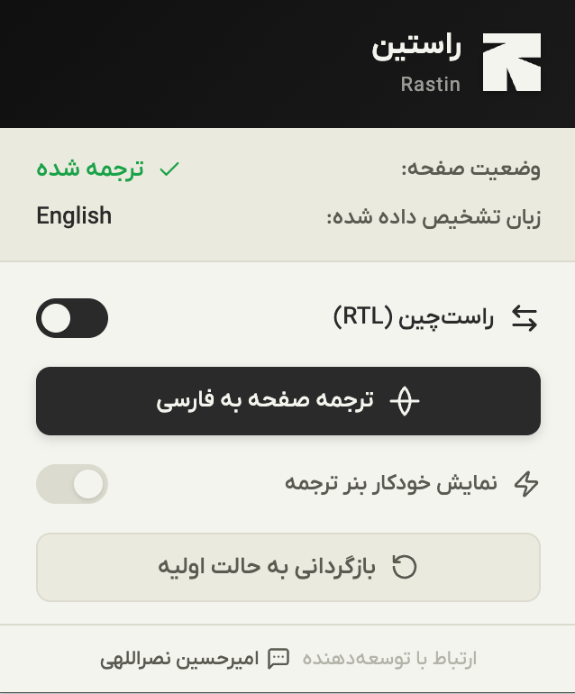

<div align="center">
  
  <h1>Rastin — Farsi Translator for Chrome</h1>
  <p><strong>راستین</strong> — <em>"honest" in Persian</em></p>
  <p>
    <strong>Author:</strong> Amirhossein Nasrollahi —
    <a href="https://ble.ir/Amir83Nasr">@Amir83Nasr</a>
  </p>
</div>

---

Rastin is a Chrome extension that translates non-Persian web pages to Persian (Farsi) with full **RTL layout support** using the bundled **Iran Yekan X** font. It's lightweight, dependency-free, and respects the page's original content — no reload needed to revert.

## ✨ Features

- **Full-page translation** — automatically translate non-Persian pages to Persian using the free Google Translate API
- **RTL support** — automatic right-to-left layout with the Iran Yekan X font (Regular, Medium, DemiBold)
- **Select-to-translate** — select any text on a page, right-click, and translate instantly
- **Smart code detection** — code blocks, library names, CLI commands, and tech identifiers are left untranslated (3-layer detection system)
- **Translation cache** — repeated texts are cached in-memory and in `chrome.storage.session` for instant reuse
- **Progressive rendering** — visible content is translated first; off-screen content is deferred via `requestIdleCallback`
- **No-page-reload restore** — revert to the original content instantly without refreshing the page
- **Parallel batch processing** — 3 concurrent fetch workers, 30 texts per batch, 500 DOM updates per frame
- **Error recovery** — automatic retry with exponential backoff, circuit breaker for rate limits, and individual fallback on batch failures
- **Keyboard shortcuts:**
  - `Ctrl+Shift+T` — translate the page
  - `Ctrl+Shift+R` — toggle RTL
  - `Ctrl+Shift+F` — open the extension popup
- **No API key needed** — uses the free Google Translate API (`client=gtx`)
- **Persian font** — Iran Yekan X, bundled and injected via JavaScript for extension URL compatibility

## 📸 Screenshots

### Before / After

<div align="center">
  
  
</div>

### Extension Popup



## 📦 Installation

### From Chrome Web Store

> Coming soon...

### Manual (Developer Mode)

1. Open Chrome and go to `chrome://extensions`
2. Enable **Developer Mode** (toggle in the top-right corner)
3. Click **Load unpacked** and select the project folder
4. Done! 🎉

## 🚀 Usage

1. Click the extension icon in the toolbar to open the popup
2. Click **Translate** to start translating, or use `Ctrl+Shift+T`
3. You can also right-click anywhere on the page and select **Translate Selection**

### Page Controls

- **Translate & RTL** — translate the page and enable right-to-left layout
- **RTL Only** — just enable right-to-left layout without translating
- **Reset** — restore the page to its original content (no reload needed)
- **Auto Banner** — toggle the automatic translation banner at the top of the page

## 🗂 Project Structure

```text
Rastin/
  _locales/
    en/messages.json           # English i18n strings
    fa/messages.json           # Persian i18n strings
  fonts/
    IRANYekanX/                # Iran Yekan X font (3 weights)
    Cartograph CF/             # Programming font (optional)
  icons/
    icon.svg                   # Logo (source)
    icon.png                   # Logo (PNG fallback)
    popup.png                  # Screenshot
  lib/
    errors.js                  # Error management system (IIFE, self.RastinErrors)
  popup/
    popup.html                 # Popup UI
    popup.js                   # Popup logic
    popup.css                  # Popup styles
    icons.js                   # SVG icon system
  scripts/
    content.js                 # Content script — translation, RTL, banner
    background.js              # Service worker — install, menus, shortcuts
    code-detection.js          # Code-like content detection (3 layers)
  styles/
    content.css                # Content styles (RTL + banner)
  manifest.json                # Extension entry point
```

## 🛠 Tech Stack

| Technology           | Description                                              |
| -------------------- | -------------------------------------------------------- |
| Manifest V3          | Latest Chrome extension API                              |
| Google Translate API | Free, no key needed (`client=gtx&sl=auto&tl=fa&dt=t&q=`) |
| Iran Yekan X         | Persian typeface (Regular, Medium, DemiBold)             |
| Prettier             | Code formatting                                          |
| Inline SVG Icons     | Custom Lucide-style icons (12 paths)                     |

## 💻 Development

### Prerequisites

- Chrome / Chromium browser
- No npm, Node.js, or build tools required — the extension is dependency-free

### Code Formatting

```bash
npx prettier --write <file>
```

The project uses **Prettier** with `semi`, `singleQuote`, `trailingComma: all`.  
A pre-commit hook auto-formats staged files:

```bash
git config core.hooksPath .githooks
```

### Testing Locally

1. Go to `chrome://extensions`
2. Enable **Developer Mode**
3. Click **Load unpacked** → select the project root
4. After code changes, refresh the extension via the 🔄 button on the extension card

## 🔧 Common Issues

| Issue                              | Fix                                                                                            |
| ---------------------------------- | ---------------------------------------------------------------------------------------------- |
| SVG as extension icon              | Use the PNG fallback — Chrome doesn't reliably render SVG extension icons                      |
| Font not loading in content script | Font is injected via JS (`chrome.runtime.getURL()`) — CSS can't use `chrome-extension://` URLs |
| `importScripts` not working        | Don't use `"type": "module"` in the background service worker — `importScripts` won't work     |
| Extension icon not showing         | Make sure `manifest.json` icon paths point to PNG files, not SVG                               |

## 📝 License

**MIT** — free for personal and commercial use.

## ☕ Support

If you find Rastin useful, consider supporting the project:

- **Card-to-Card donation** — through the "Donate" section in the extension popup
- **Star** ⭐ the project on GitHub
